# Wir sind im Urlaub 🌴

<p align="center">
  
  
  
  
</p>

Ein WordPress-Plugin, mit dem du den Betriebsurlaub einträgst und Besucher deiner Webseite elegant darüber informierst – als Balken, Popup oder schwebende Karte. Nach dem letzten Urlaubstag verschwindet der Hinweis automatisch.

<p align="center">
  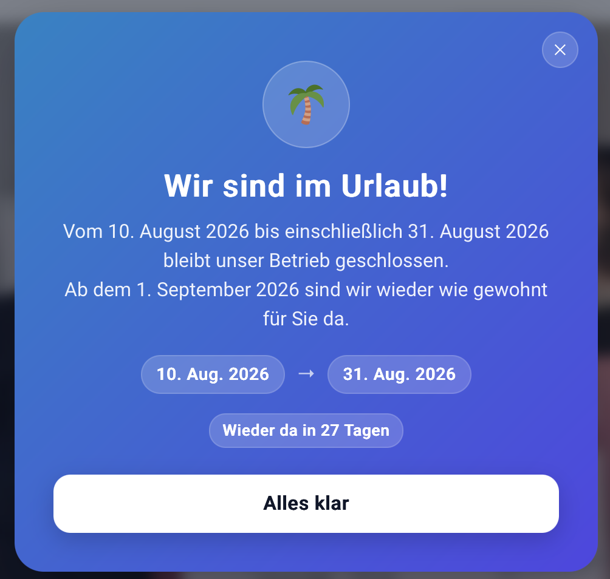
</p>

## Funktionen

- **Zeitraum mit Datum + Uhrzeit** – erster und letzter Urlaubstag, Anzeige endet automatisch nach dem letzten Tag (Standard: 23:59 Uhr, einstellbar).
- **Drei Darstellungen** – Balken (oben/unten), zentrales Popup mit Overlay, schwebende Karte (unten links/rechts).
- **Fünf Farbwelten** – Ozean, Sonnenuntergang, Wald, Mitternacht, Elegant – plus eigene Farben mit Farbwählern.
- **Schulferien per Klick** – Bundesland wählen, Vorschlag anklicken, Zeitraum ist eingetragen (OpenHolidays API, Fallback ferien-api.de, 12h-Cache).
- **Vorankündigung** – optional schon X Tage vor Urlaubsbeginn mit eigenem Text informieren.
- **Countdown** – „Wieder da in X Tagen“ als Chip, live aktualisiert.
- **Live-Vorschau** – direkt in den Einstellungen; zusätzlich auf der echten Seite testbar über `deineseite.de/?wsiu_preview=1` (nur für eingeloggte Admins sichtbar).
- **Popup-Frequenz** – bei jedem Aufruf, einmal pro Besuch oder einmal pro Tag; Balken/Karte können von Besuchern geschlossen werden (wird gemerkt, bis sich der Zeitraum ändert).
- **Shortcode** – `[wir_sind_im_urlaub]` bettet den Hinweis in beliebige Seiten/Beiträge ein.
- **Text-Platzhalter** – `{start}`, `{ende}`, `{wieder_da}` werden automatisch durch die formatierten Daten ersetzt.

## Screenshots

### So sehen es deine Besucher

Dezenter Balken am oberen (oder unteren) Seitenrand – mit Countdown und Schließen-Button:


| Schwebende Karte in der Ecke | Popup mit eigenen Farben |
|:---:|:---:|
| 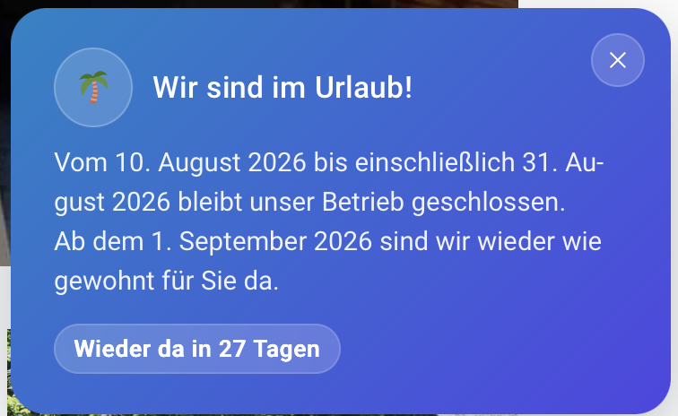 | 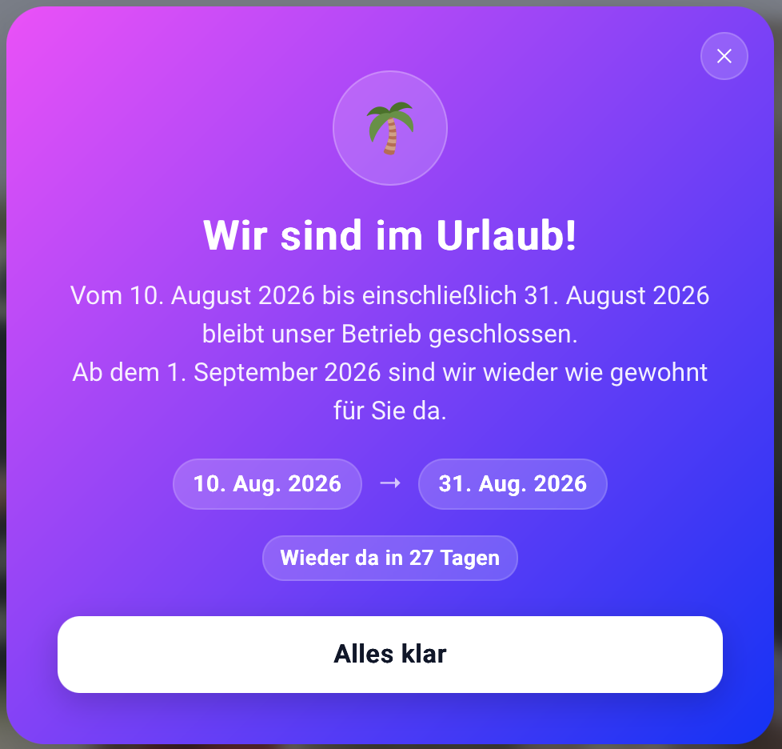 |

Eine Farbwelt für jeden Geschmack – oder gleich komplett eigene Farben:

| Wald | Sonnenuntergang | Elegant | Mitternacht |
|:---:|:---:|:---:|:---:|
| 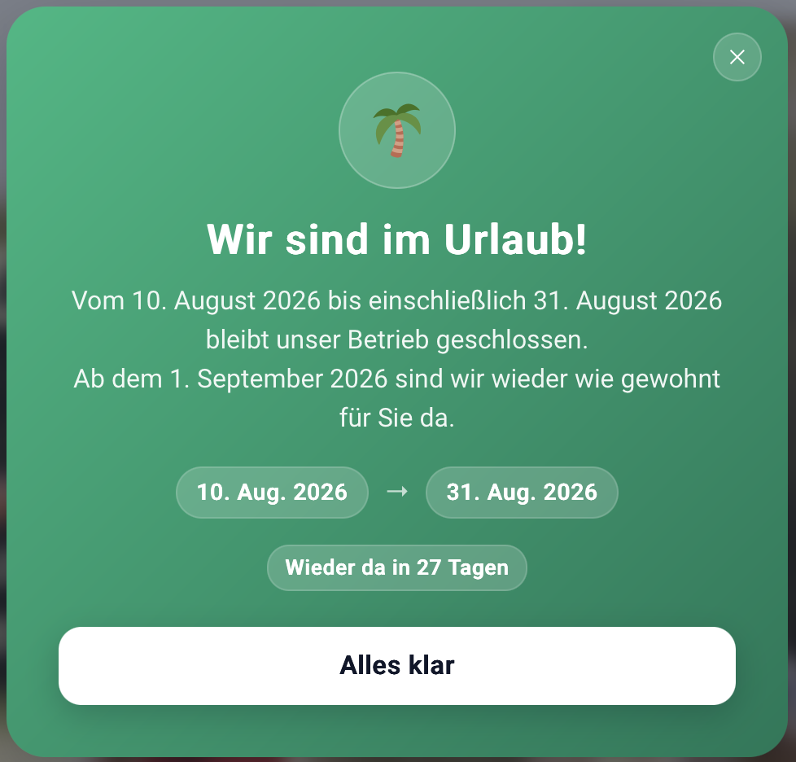 | 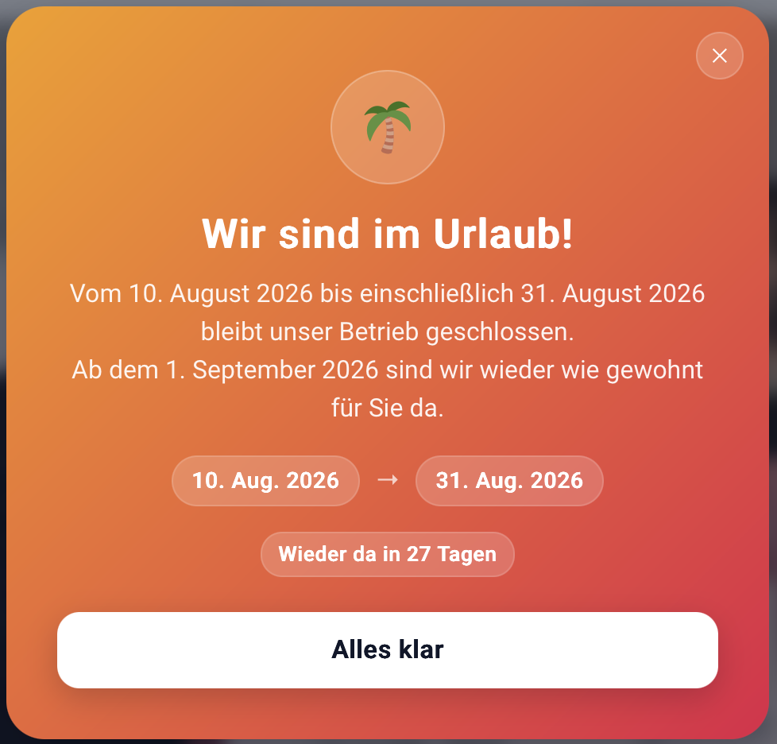 | 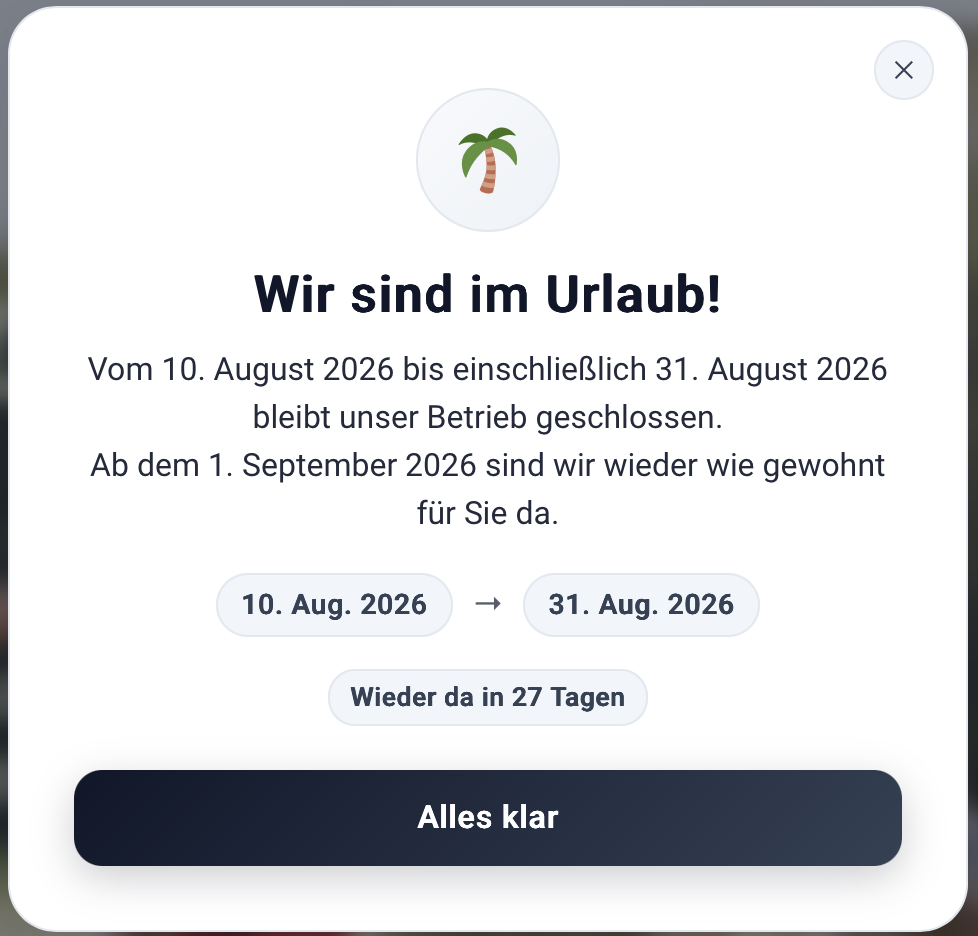 | 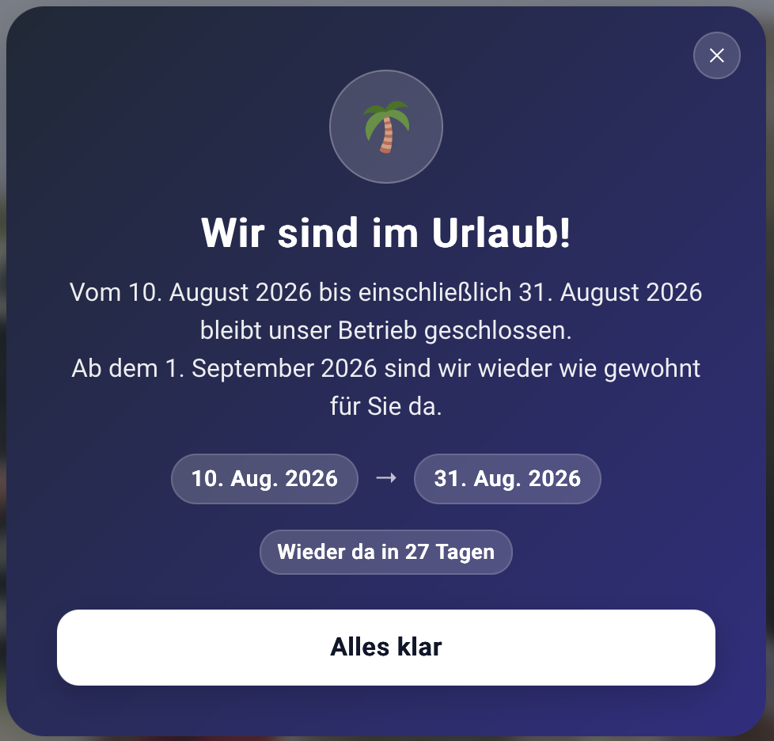 |

### Das Backend: alles auf einer Seite, mit Live-Vorschau

| | |
|:---:|:---:|
| 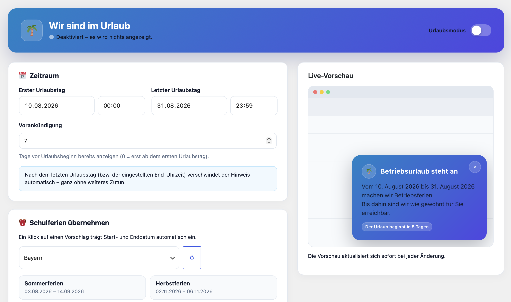<br><sub>**Zeitraum festlegen** – inkl. Uhrzeit, Vorankündigung und automatischem Ausblenden</sub> | 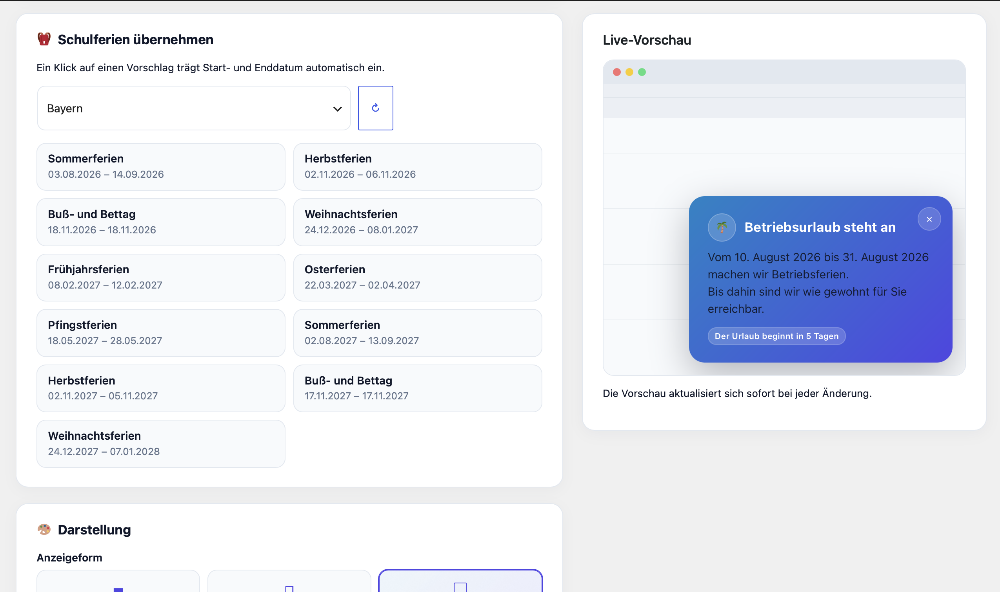<br><sub>**Schulferien per Klick** – Vorschläge für alle 16 Bundesländer, live aus der Ferien-API</sub> |
| 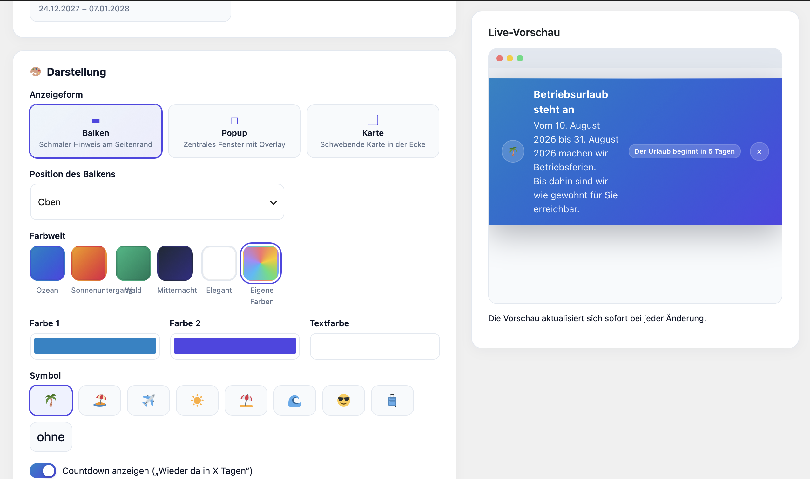<br><sub>**Balken-Modus** – die Vorschau rechts aktualisiert sich bei jeder Änderung sofort</sub> | 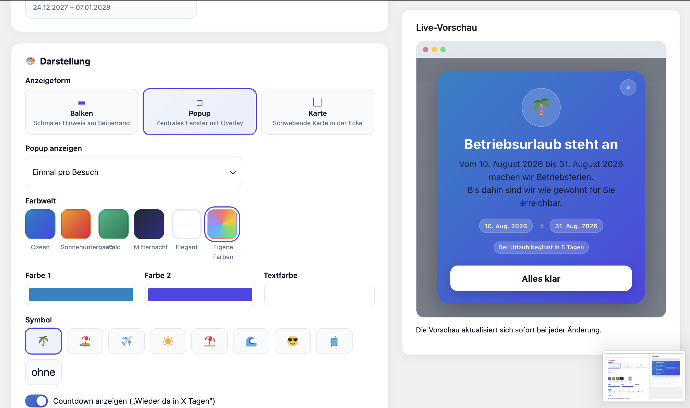<br><sub>**Popup-Modus** – mit Datums-Pills, Countdown und Bestätigungs-Button</sub> |
| 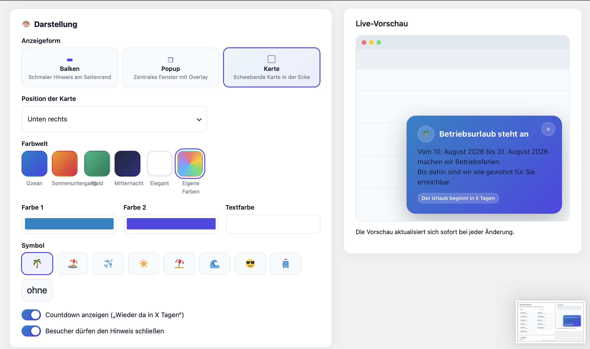<br><sub>**Darstellung** – Anzeigeform, Farbwelten, eigene Farben und Symbole</sub> | 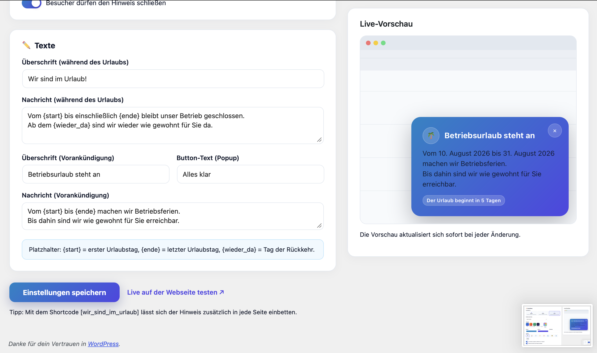<br><sub>**Texte** – frei anpassbar, mit Platzhaltern für Start, Ende und Rückkehr</sub> |

## Installation

**Variante A (Release-ZIP):** Unter *Releases* das ZIP herunterladen und im WordPress-Admin unter *Plugins → Installieren → Plugin hochladen* einspielen.

**Variante B (Ordner):** Dieses Repository als Ordner `wir-sind-im-urlaub/` nach `wp-content/plugins/` kopieren und das Plugin aktivieren.

Danach erscheint im Admin-Menü der Punkt **„Urlaubsmodus“** (mit Palmen-Icon 🌴).

## Woher kommen die Schulferien-Daten?

Schulferien werden von den Kultusministerien der Bundesländer festgelegt und lassen sich nicht berechnen. Das Plugin lädt die Termine deshalb serverseitig von der freien [OpenHolidays API](https://openholidaysapi.org); ist diese nicht erreichbar, dient [ferien-api.de](https://ferien-api.de) als Fallback. Ergebnisse werden 12 Stunden zwischengespeichert, die Abfrage ist nur für eingeloggte Administratoren möglich (Nonce- und Berechtigungsprüfung).

## Technik

- PHP ≥ 7.4, WordPress ≥ 5.8, keine externen Bibliotheken, kein Build-Schritt.
- Saubere OOP-Struktur (`WSIU\Plugin`, `Settings`, `Frontend`, `Admin`, `SchoolHolidays`).
- Alle Eingaben werden validiert/sanitisiert, Ausgaben escaped, AJAX mit Nonce + Capability-Check.
- Zeitzonen-korrekt über die WordPress-Einstellung (`wp_timezone()`).
- Barrierefrei: `role="dialog"`, ESC schließt das Popup, Fokus-Stile, `prefers-reduced-motion` wird respektiert.
- Deinstallation räumt Optionen und Caches vollständig auf.

## Ordnerstruktur

```
wir-sind-im-urlaub/
├── wir-sind-im-urlaub.php        # Bootstrap
├── uninstall.php                 # Aufräumen bei Deinstallation
├── readme.txt                    # WordPress.org-Readme
├── includes/
│   ├── class-wsiu-plugin.php     # Orchestrator
│   ├── class-wsiu-settings.php   # Defaults, Validierung, Zeitraum-Logik
│   ├── class-wsiu-frontend.php   # Ausgabe (Balken/Popup/Karte/Shortcode)
│   ├── class-wsiu-admin.php      # Einstellungsseite + AJAX
│   └── class-wsiu-school-holidays.php  # Ferien-APIs + Cache
└── assets/
    ├── css/frontend.css          # Frontend-Design (Farbwelten)
    ├── css/admin.css             # Admin-Design
    ├── js/frontend.js            # Ablauf-Check, Countdown, Schließen-Logik
    └── js/admin.js               # Live-Vorschau, Ferien-Vorschläge
```

## Lizenz

Dieses Plugin ist freie Software und steht unter der [GNU General Public License v2 (oder später)](LICENSE) – derselben Lizenz wie WordPress selbst.
